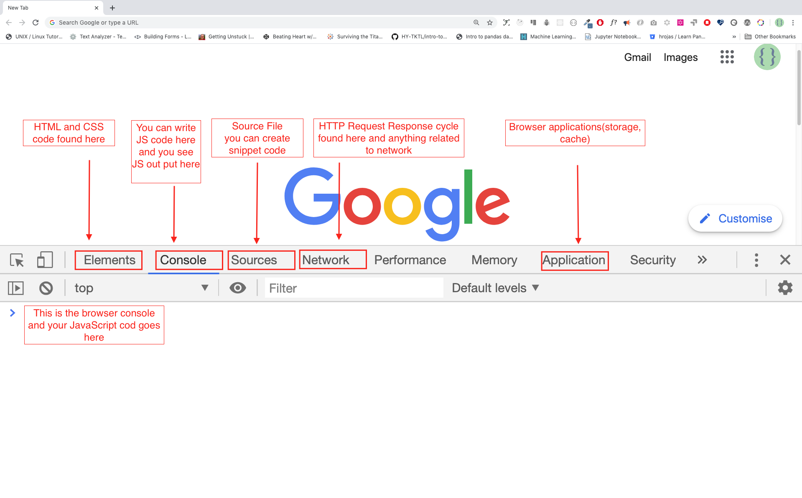
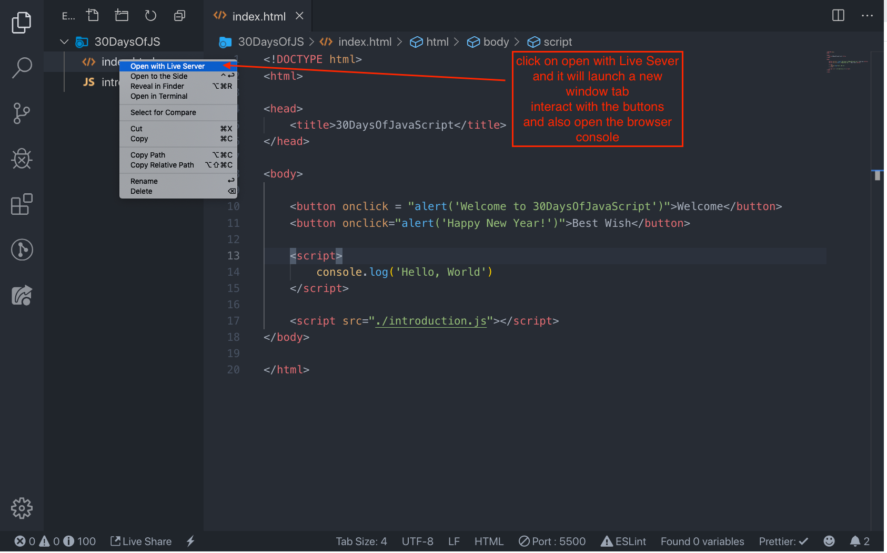

# 30 天学习 JavaScript：简介

[TOC]

## 简介

祝贺你决定参与 30 天学习 JavaScript 编程的挑战。在这个挑战中，你将会学到一切你在使用 JavaScript 编程中所需要的知识，更一般地说，了解整个编程的概念。在挑战的最后，你会获得“30 天学习 JavaScript” 编程挑战的结业证书。如果你需要帮助或者你想帮助别人，你可以加入 [telegram group](https://t.me/ThirtyDaysOfJavaScript)。

30 天学习 JavaScript 挑战是对 JavaScript 新手和高级开发者的一份指导。欢迎来到 JavaScript 世界。JavaScript 是一种网络语言。我很喜欢使用和教授 JavaScript，希望你也能。

在这个手把手教学 JavaScript 的挑战中，你将会学习 JavaScript--人类历史上最受欢迎的编程语言。JavaScript 被用于交互式网站，开发移动 app，桌面应用，游戏，以及今天 JavaScript 甚至还用于 机器学习和 AI。近年来，JavaScript（JS）的流行程度越来越受欢迎，并且是连续六年的领先编程语言，并且是 GitHub 上最常用的编程语言。

## 要求

这个挑战没有编程基础知识的要求，你仅仅需要：

1. 动机
2. 一台电脑
3. 网络
4. 浏览器
5. 代码编辑器

## 安装

我相信你有动机和强烈的欲望去成为一名开发者，也有一台电脑和网络。如果你有这些，那就万事俱备了。

### 安装 Node.js

你可能现在不需要 Node.js，但稍后你会需要的。[node.js](https://nodejs.org/en/)


下载好以后，双击安装：


我们可以检测 node 是否已安装在本地机器上，打开终端，键入以下命令；

```
node -v
v12.14.0
```

在编写这个教程时我用的 node 是 v12.14.0 版本，但现在的推荐版本是 v14.17.6。

> 翻译时，推荐版本时 v16.14.0.

### 浏览器

如果你还没有一个浏览器，那就安装谷歌浏览器（[Google Chrome](https://www.google.com/chrome/)）。我们可以在浏览器控制台写一点简单的 JavaScript 代码，但是我们不能用浏览器控制台去开发应用。


#### 打开谷歌浏览器控制台

你可以通过点击浏览器右上角的三点，选择“更多工具 -> 开发者工具” 来打开谷歌浏览器控制台，或者使用快捷键。我偏爱使用快捷键。


打开谷歌浏览器控制台的快捷键：

```sh
# Mac
Command + Option + J

# Windows/Linux
Ctl + Shift + J
```



> `Ctl + Shift + i`，也可以，事实上，我的设备显示的快捷键就是这个。

在你打开谷歌浏览器控制台以后，尝试探索标签按钮。我们会花很多时间在控制台的。控制台是你运行 JavaScript 代码的地方。谷歌浏览器使用 V8 引擎将你的代码编译为机器码。让我们在控制台写点代码试试。


#### 在浏览器控制台写代码

我们可以在谷歌浏览器或任意其他浏览器的控制台写任何 JavaScript 代码。然而，在这个挑战里，我们仅仅聚焦于谷歌浏览器的控制台。打开控制台使用以下命令：

```she
Mac
Command+Option+I

Windows:
Ctl+Shift+I
```

##### `Console.log`

我们使用 JavaScript 内置的 `console.log` 函数来实现第一行代码。通过传入参数作为输入的数据，让函数输出结果。将 “Hello, World” 作为输入数据或参数，传递给 `console.log` 函数。

```js
console.log('Hello, World!');
```

##### `Console.log` 与多个参数

`console.log` 函数可以接受多个用逗号隔开的参数。语法看起来是这个样子：`console.log(param1, param2, param3)`。


```js
console.log('Hello', 'World', '!')
console.log('HAPPY', 'NEW', 'YEAR', 2020)
console.log('Welcome', 'to', 30, 'Days', 'Of', 'JavaScript')
```

如你看到以上代码片段所示，`console.log` 可以接收多个参数。

祝贺，你已经用 `console.log` 写下了你的第一个 JavaScript 代码。

#### 注释

我们给代码添加注释。注释让代码更具可读性，这一点很重要，并且还可以在代码中留下我们的评论。 JavaScript 不会执行注释部分的代码。在 JavaScript 中，任何以 `//` 为开始的文本行都是注释，并且任何像这样以 `/* */` 包裹起来的也是注释。

例子：单行注释

```js
// 这是第一行注释
// 这是第二行注释
// 我是单行注释
```

例子：多行注释

```js
/*
这是多行注释
 多行注释可以占据多行
 JavaScript 是一种互联网语言
 */
```

#### 语法

编程语言很像人类语言。英语或许多其他语言都使用单词，短语，句子，复合句子等来传达有意义的消息。英语的语法意思是单词和短语的排序，以便在语言中创造良好的句子。语法的技术定义是计算机语言中的语句结构。编程语言有语法。JavaScript 是编程语言，和其他编程语言一样有自己的语法。如果我们写出 JavaScript 不能“理解”的语法，那么 JavaScript 将会产生不同类型的错误。稍后我们将会探究 JavaScript 不同类型的错误。现在，让我们看看语法错误吧。


我故意制造了一个错误，因此，控制台提示了语法错误。实际上，语法非常有用。它能告诉你产生了哪种类型的错误。通过阅读错误反馈机制，我们能纠正语法，修复问题。在编程中确定和移除错误的过程被称为调试（debugger）。让我们修复以下错误：

```js
console.log('Hello, World!')
```

到目前为止，我们看到如何使用 `console.log()` 显示文字。如果我们要使用 `console.log()` 打印文字或字符串，那么文字必须要放到单引号，双引号或者反引号（``）中。

```js
console.log('Hello, World!')
console.log("Hello, World!")
console.log(`Hello, World!`)
```

#### 算术

现在，让我们在谷歌浏览器控制台上，使用 `console.log` 来编写更多针对数值类型的 JavaScript 代码。除了文本外，我们也可以使用 JavaScript 来做数学运算。让我们做做下面这些简单的计算吧！可以在 Google Chrome 控制台的 Console 面板直接使用 `Console.log` 函数来编写 JavaScript 代码。但是，它包含在此引言中，因为大多数挑战都将在文本编辑器中进行，在该文本编辑器中，该功能的使用将是强制性的。您可以直接使用控制台上的说明进行演示。


```js
console.log(2 + 3) // Addition
console.log(3 - 2) // Subtraction
console.log(2 * 3) // Multiplication
console.log(3 / 2) // Division
console.log(3 % 2) // Modulus - finding remainder
console.log(3 ** 2) // Exponentiation 3 ** 2 == 3 * 3
```

### 代码编辑器

我们可以在浏览器控制台上编写代码，但不能用于更大的项目。在真实的工作环境中，开发人员使用不同的代码编辑器来编写代码。在这 30 天的 JavaScript 挑战中，我们将使用 Visual Studio Code 这款代码编辑器。

#### 安装 Visual Studio Code

Visual Studio Code 是一款非常受欢迎的开源文本编辑器。我推荐在 [官网下载](https://code.visualstudio.com/)。如果你偏爱其它编辑器，请随意。


如果你已安装好 Visual Studio Code，那我们就开始使用它吧。

#### 使用 Visual Studio Code

双击 Visual Studio Code 图标打开编辑器。当你打开 Visual Studio Code 后，你会看到这样的界面。尝试与标记的图标进行交互。





## 向网页添加 JavaScript

JavaScript 可以通过三种不同的方式添加到网页中：

- Inline script 行内脚本
- Internal script 内部脚本
- External script 外部脚本
- Multiple External scripts 多个外部脚本

以下部分显示了向网页添加 JavaScript 代码的不同方法。

### 行内脚本

在桌面或任何位置创建项目文件夹，将其命名为 `30DaysOfJS`，并在项目文件夹中创建 `index.html` 文件。然后粘贴以下代码并在浏览器中打开，例如 Chrome 浏览器。

```html
<!DOCTYPE html>
<html>
  <head>
    <title>30DaysOfScript:Inline Script</title>
  </head>
  <body>
    <button onclick="alert('Welcome to 30DaysOfJavaScript!')">Click Me</button>
  </body>
</html>
```

现在，你刚刚编写了第一个内联脚本。我们可以使用 `alert()`内置函数创建一个弹出的警报消息。

### 内部脚本

内部脚本可以写在 `<head></head>` 或 `<body></body>` 中，但最好放在 HTML 文档的 `<body></body>` 中。首先，让我们把脚本写在文档的 `<head></head>` 部分。

```html
<!DOCTYPE html>
<html>
  <head>
    <title>30DaysOfScript:Internal Script</title>
    <script>
      console.log('Welcome to 30DaysOfJavaScript')
    </script>
  </head>
  <body></body>
</html>
```

这是我们大多数时候编写内部脚本的方式。在 `<body></body>` 部分编写 JavaScript 代码是最优选的选项。打开浏览器控制台以查看 `console.log()` 的输出。

```html
<!DOCTYPE html>
<html>
  <head>
    <title>30DaysOfScript:Internal Script</title>
  </head>
  <body>
    <button onclick="alert('Welcome to 30DaysOfJavaScript!');">Click Me</button>
    <script>
      console.log('Welcome to 30DaysOfJavaScript')
    </script>
  </body>
</html>
```

打开浏览器控制台以查看 `console.log()` 的输出。


### 外部脚本

与内部脚本类似，外部脚本链接可以位于 `<head></head>` 或 `<body></body>` 中，但最好将其放在 `<body></body>` 中。

首先，我们应该创建一个扩展名为 `.js` 的外部 JavaScript 文件。所有以 `.js` 扩展名结尾的文件都是 JavaScript 文件。在项目目录中创建一个名为 `introduction.js` 的文件，并编写以下代码，并在正文底部链接此 `.js` 文件。

```js
console.log('Welcome to 30DaysOfJavaScript')
```

将外部脚本放入  `<head></head>`：

```html
<!DOCTYPE html>
<html>
  <head>
    <title>30DaysOfJavaScript:External script</title>
    <script src="introduction.js"></script>
  </head>
  <body></body>
</html>
```

将外部脚本放入 `<body></body>`：

```html
<!DOCTYPE html>
<html>
  <head>
    <title>30DaysOfJavaScript:External script</title>
  </head>
  <body>
    <!-- it could be in the header or in the body -->
    <!-- Here is the recommended place to put the external script -->
    <script src="introduction.js"></script>
  </body>
</html>
```

打开浏览器控制台以查看 `console.log()` 的输出。

### 多个外部脚本

我们还可以将多个外部 JavaScript 文件链接到一个网页。在 30DaysOfJS 文件夹中创建 `helloworld.js` 文件，并编写以下代码。

```js
console.log('Hello, World!')
```

```html
<!DOCTYPE html>
<html>
  <head>
    <title>Multiple External Scripts</title>
  </head>
  <body>
    <script src="./helloworld.js"></script>
    <script src="./introduction.js"></script>
  </body>
</html>
```

`main.js` 文件应位于所有其他脚本之下。记住这一点非常重要。


## 数据类型简介

在 JavaScript 和其他编程语言中，有不同类型的数据类型。以下是 JavaScript 原始数据类型：`String`、`Number`、`Boolean`、`undefined`、`Null` 和 `Symbol`。

### 数值

整数：整数（负数、零和正数）示例：-3, -2, -1, 0, 1, 2, 3 ...

浮点数：十进制数示例 -3.5, -2.25, -1.0, 0.0, 1.1, 2.2, 3.5 ...

### 字符串

两个单引号、双引号或反引号之间的一个或多个字符的集合。

```
'Asabeneh'
'Finland'
'JavaScript is a beautiful programming language'
'I love teaching'
'I hope you are enjoying the first day'
`We can also create a string using a backtick`
'A string could be just as small as one character as big as many pages'
```

### 布尔值

布尔值为 `True` 或 `False`。任何比较都会返回一个布尔值，该值为真或假。

布尔数据类型是 `true` 或 `false` 两者之一值。

```js
true // if the light is on, the value is true
false // if the light is off, the value is false
```

### Undefined

在 JavaScript 中，如果不为变量赋值，则该值是 `undefined`。此外，如果函数没有返回任何内容，则返回 `undefined`。

```js
let firstName
console.log(firstName) // undefined, because it is not assigned to a value yet
```

### Null

JavaScript 中的 `Null` 表示空值。

```js
let emptyValue = null
```

## 检测数据类型

要检查某个变量的数据类型，我们使用 `typeof` 运算符。请参见以下示例。

```js
console.log(typeof 'Asabeneh') // string
console.log(typeof 5) // number
console.log(typeof true) // boolean
console.log(typeof null) // object type
console.log(typeof undefined) // undefined
```

## 又见注释

请记住，JavaScript 中的注释与其他编程语言类似。注释对于提高代码可读性非常重要。有两种评论方式：

- 单行注释
- 多行注释

```js
// commenting the code itself with a single comment
// let firstName = 'Asabeneh'; single line comment
// let lastName = 'Yetayeh'; single line comment
```

多行注释：

```js
/*
  let location = 'Helsinki';
  let age = 100;
  let isMarried = true;
  This is a Multiple line comment

*/
```

## 变量

变量是数据的容器。变量用于将数据存储在内存位置。声明变量时，将保留一个内存位置。当变量分配给一个值（数据）时，内存空间将填充该数据。要声明变量，我们使用 `var`、`let` 或 `const` 关键字。

对于随时间不同而变化的变量，我们使用 `let`。如果数据完全不变，我们使用 `const`。例如，`PI`、国家名称、重力不变，我们可以使用 `const`。我们不会在这个挑战中使用 `var`，我也不建议您使用它。这是一种容易出错的声明变量的方法，它有很多泄漏。我们将在其他部分（范围）中详细讨论 `var`、`let` 和 `const`。目前，以上解释已经足够了。

有效的 JavaScript 变量名必须遵循以下规则：

- JavaScript 变量名不应以数字开头。

- JavaScript 变量名不允许使用美元符号（`$`）和下划线（`_`）以外的特殊字符。

- JavaScript 变量名遵循 camelCase 命名法。

- JavaScript 变量名不应在单词之间有空格。

以下是有效 JavaScript 变量的示例。

```
firstName
lastName
country
city
capitalCity
age
isMarried

first_name
last_name
is_married
capital_city

num1
num_1
_num_1
$num1
year2020
year_2020
```

列表中的第一个和第二个变量遵循在 JavaScript 中声明的 camelCase 约定。在本材料中，我们将使用 camelCase 变量。

无效变量示例：

```
first-name
1_num
num_#_1
```

让我们声明具有不同数据类型的变量。要声明变量，我们需要在变量名称之前使用 `let` 或 `const` 关键字。在变量名之后，我们写一个等号（赋值运算符）和一个值（赋值数据）。

```js
// Syntax
let nameOfVariable = value
```

- **声明变量的示例**

```js
// Declaring different variables of different data types
let firstName = 'Asabeneh' // first name of a person
let lastName = 'Yetayeh' // last name of a person
let country = 'Finland' // country
let city = 'Helsinki' // capital city
let age = 100 // age in years
let isMarried = true

console.log(firstName, lastName, country, city, age, isMarried)
```

```
Asabeneh Yetayeh Finland Helsinki 100 true
```

```js
// Declaring variables with number values
let age = 100 // age in years
const gravity = 9.81 // earth gravity  in m/s2
const boilingPoint = 100 // water boiling point, temperature in °C
const PI = 3.14 // geometrical constant
console.log(gravity, boilingPoint, PI)
```

```
9.81 100 3.14
```

```js
// Variables can also be declaring in one line separated by comma
let name = 'Asabeneh', // name of a person
job = 'teacher',
live = 'Finland'
console.log(name, job, live)
```

```
Asabeneh teacher Finland
```

当你在 `01-Day` 文件夹中运行 `index.html` 文件时，你应该会看到：


你太棒了！你刚刚完成了第 1 天的挑战，你正在迈向伟大。现在做一些锻炼你的大脑和肌肉的运动。

## 练习

1. 编写单行注释：注释可以使代码可读

2. 写另一条注释：欢迎来到 30DaysOfJavaScript

3. 编写多行注释：注释可以使代码可读、易于重用和信息丰富

4. 创建 `variable.js` 文件，并声明 `string`、`boolean`、`undefined` 和 `null` 数据类型的变量

5. 创建 `datatypes.js` 文件，并使用 JavaScript `typeof` 运算符检查不同的数据类型。检查每个变量的数据类型

6. 声明四个变量而不赋值

7. 声明四个变量并赋值

8. 声明变量，以多行形式存储你的名字、姓氏、婚姻状况、国家和年龄

9. 声明变量，以单行形式存储你的名字、姓氏、婚姻状况、国家和年龄

10. 声明两个变量 `myAge` 和 `yourAge`，并为它们分配初始值，并将其在览器控制台输出。

```
I am 25 years old.
You are 30 years old.
```
